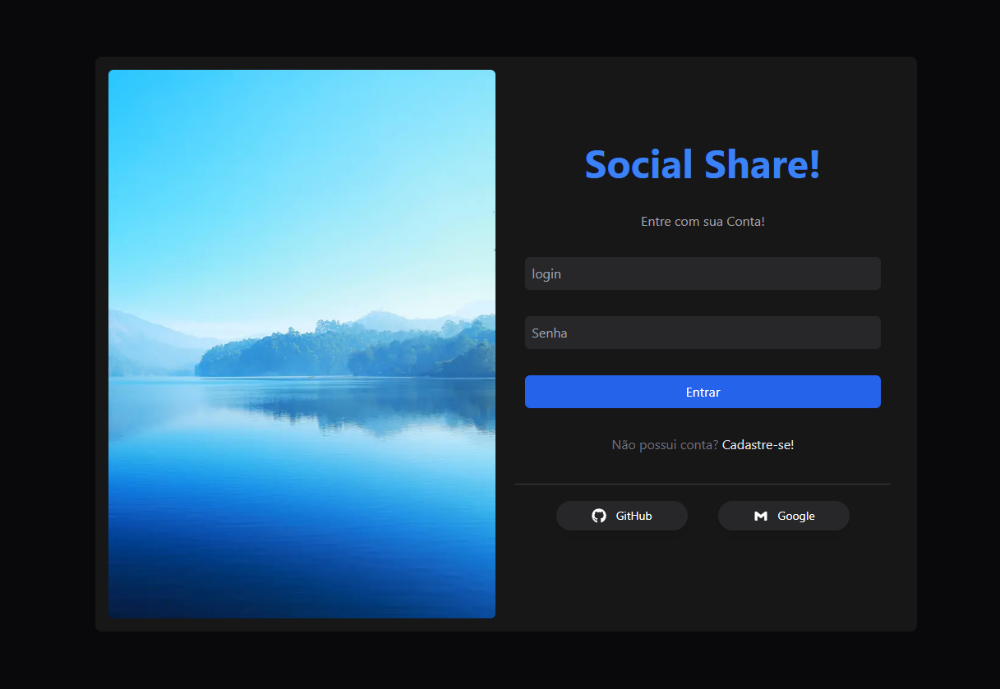
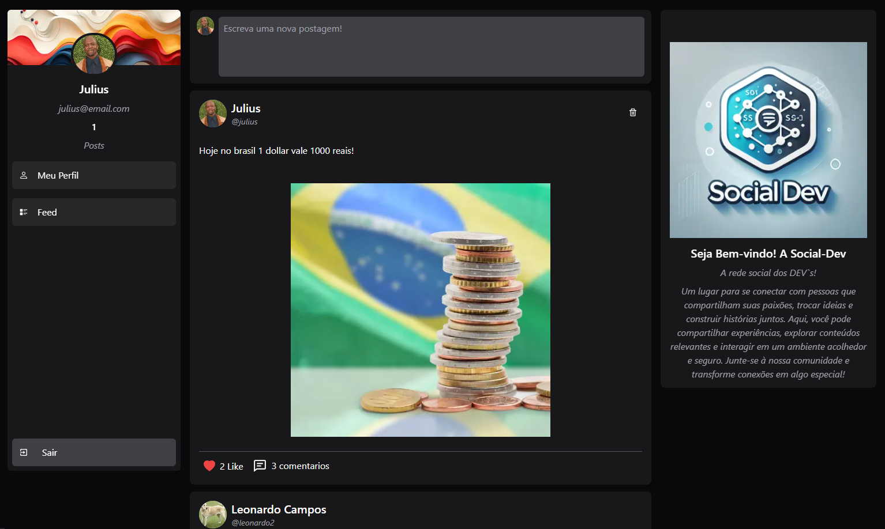
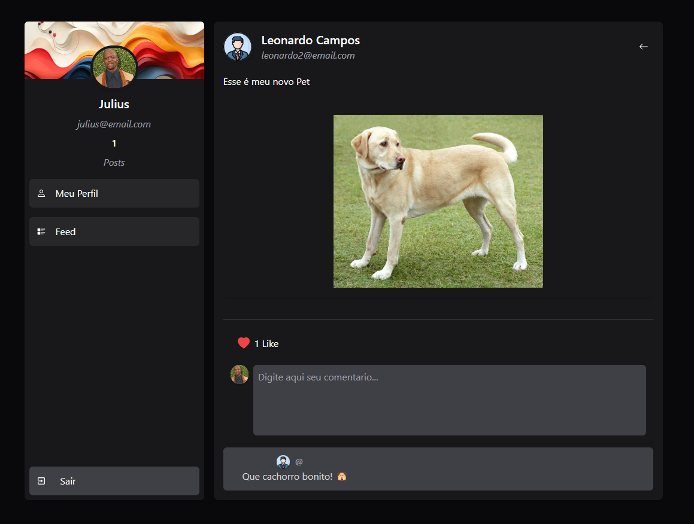

# 📌 Rede Social (Back end)


Front End da aplicação rede social. Projeto desenvolvido como laboratório de estudos para aplicar novos conceitos e boas práticas de arquitetura e engenharia de software.


## 📚 Estudos Implementados

- [✅] Rotas Next
- [✅] Intercepting Routers Next
- [✅] Server Actions
- [✅] Server components e client Components
- [🔄️] Testes automatizados
- [🔄️] SEO

## 📷 Imagens do projeto
<div>
  
  
  
</div>


## ⚙️ Tecnologias Utilizadas

Este projeto foi desenvolvido com as seguintes tecnologias:

- 🔹 [Next JS](#)
- 🔹 [React JS](#)
- 🔹 [Typescript](#)
- 🔹 [Vitest](#)


## 🛠️ Instalação e Configuração
### 📌 Pré-requisitos
Antes de começar, certifique-se de ter instalado:

Node.js (versão 23+)

Next.js (versão 15+)

#### 🎲 Iniciar a API do Backend

-  [Backend Social Media](https://github.com/CamposLeo95/projeto_back_post)


#### 📥 Clone o repositório

```bash
git clone https://github.com/CamposLeo95/social_media_front.git
cd social_media_front

```

#### 📦 Instale as dependências

```bash
npm install
```

#### 🔧 Configuração do Ambiente

```bash
AUTH_SECRET= 
NEXT_PUBLIC_API_URL=
```
## 🚀 Como Executar o Projeto

#### 🔥 Rodando em Desenvolvimento
```bash
npx prisma db pull && npx prisma generate && npm run dev
```
#### 🐳 Rodando com Docker
```bash
docker-compose up --build
```

## 🧪 Testes
Para rodar os testes, utilize:
```bash
npm run test
```

## 📌 Rotas e Endpoints

### 🏷️ Autenticação
| Rota             | Descrição           | 
|------------------|---------------------|
| `/auth`          | Login do usuario    |
| `/register`      | Cadastro do usuario |

### 📝 Postagens
| Rota                                        | Descrição                    | 
|---------------------------------------------|------------------------------|
| `/app/posts`                                | Feed de Postagens            |
| `/app/posts/create-post`                    | Criar uma postagem           |
| `/app/posts`                                | Feed de Postagens            |
| `/app/posts[idPost]/comment`                | Feed de Comentarios          |
| `/app/posts[idPost]/comment/create-comment` | Criar um comentario no post  |

### 📝 Usuarios
| Rota                    | Descrição           | 
|-------------------------|---------------------|
| `/profile[id]`          | Perfil do usuario   |


## 📂 Estrutura do Projeto

```bash
projeto/
│-- 📂 .next/
│-- 📂 @types/
│-- 📂 node_modules/
│-- public/
│-- 📂 src/
│     ├── 📂api/
│         ├── 📂 auth/
│         ├── 📂 comments/
│         ├── 📂 like/
│         ├── 📂 logout/
│         ├── 📂 posts/
│         ├── 📂 register/
│         ├── 📂 types/
│         ├── 📂 users/
│     ├── 📂 app/
│         ├── 📂 (auth)/
│             ├── 📂 login/
│             ├── 📂 register/
│         ├── 📂 app/
│             ├── 📂 posts/
│                 ├── 📂 (comments)/
│                     ├── 📂 [id]/
│                         ├── 📂 comment/
│                             ├── 📂 @modal/
│                             ├── 📂 create-comment/
│                             ├── 📄 layout.tsx
│                             ├── 📄 page.tsx
│                 ├── 📂 @modal/
│                     ├── 📂 (.)create-post/
│                     ├── 📄 default.tsx
│                 ├── 📂 create-post/
│                 ├── 📄 loyout.tsx
│                 ├── 📄 page.tsx
│             ├── 📂 profile/
│                 ├── 📂 [id]/
│                 ├── 📄 loyout.tsx
│         ├── 📄 favicon.ico
│         ├── 📄 globals.css
│         ├── 📄 layout.tsx/
│         ├── 📄 loading.tsx/
│         ├── 📄 not-found.tsx/
│         ├── 📄 page.tsx/
│     ├── 📂 assets/
│     ├── 📂 components/
│     ├── 📂 mappers/
│     ├── 📂 utils/
│     ├── 📄setupTests.ts
│-- 📄.env
│-- 📄.env.example
│-- 📄.gitignore
│-- 📄 biome.json
│-- 📄 next-env.d.ts
│-- 📄 next.config.ts
│-- package.json
│-- package-lock.json
│-- postcss.config.mjs
│-- README.md
│-- tailwind.config.ts
│-- tsconfig.json
│-- vitest.config.mjs
```